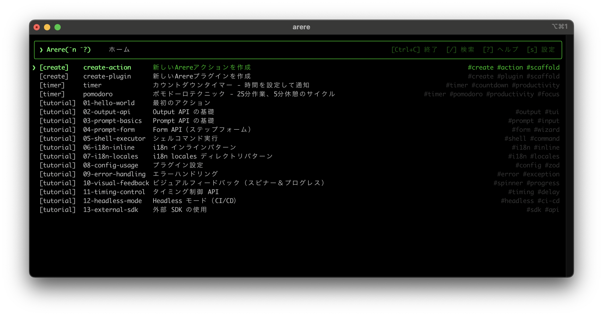

# arere

> **あれれ？何だっけ** - コマンドを覚えられない私のためのランチャー

日本語 | [English](./README.md)

[](https://github.com/SphereStacking/Arere/actions)
[](https://codecov.io/gh/SphereStacking/Arere)
[](https://www.npmjs.com/package/arere)
[](LICENSE)

TypeScriptベースの**常駐型ターミナルランチャー**。コマンドを覚える必要はありません。`arere` を起動すれば、よく使うアクションをファジー検索で実行できます。



## インストール

```bash
npm install -g arere
```

**必要要件**: Node.js >= 18.0.0

## クイックスタート

```bash
# arere をインストール
npm install -g arere

# 公式プラグインをインストール
npm install -g arere-plugin-create    # アクション生成ツール
npm install -g arere-plugin-tutorial  # ステップバイステップのチュートリアル

# arere を起動
arere

# チュートリアルアクション（例: "01-hello-world"）を選んでステップバイステップで学ぼう！
```

## ドキュメント

詳しいガイドとAPIリファレンスはドキュメントをご覧ください：

- **日本語**: [https://arere.spherestacking.com/ja](https://arere.spherestacking.com/ja)
- **English**: [https://arere.spherestacking.com/en](https://arere.spherestacking.com/en)

## ライセンス

MIT © SphereStacking
