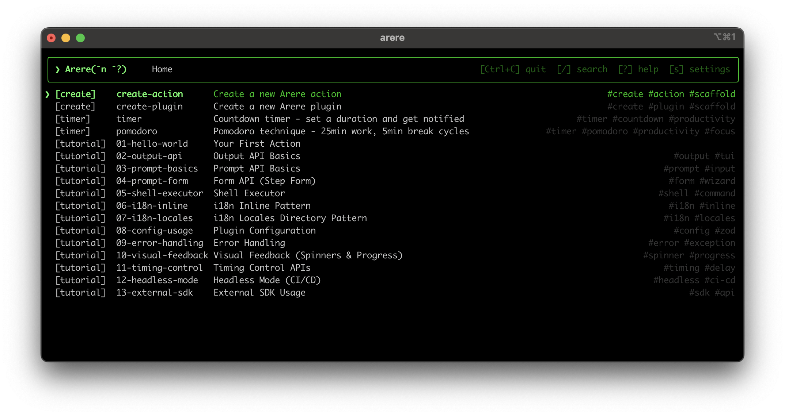

# arere

> **あれれ？何だっけ (Arere?)** - A persistent terminal launcher for those who can't remember commands

[日本語](./README.ja.md) | English

[](https://github.com/SphereStacking/Arere/actions)
[](https://www.npmjs.com/package/arere)
[](LICENSE)

A TypeScript-based **persistent terminal launcher**. No need to remember commands. Just launch `arere` and run your favorite actions with fuzzy search.



## Installation

```bash
npm install -g arere
```

**Requirements**: Node.js >= 18.0.0

## Quick Start

```bash
# Install arere
npm install -g arere

# Install official plugins
npm install -g arere-plugin-create    # Action generator
npm install -g arere-plugin-tutorial  # Step-by-step tutorials

# Launch arere
arere

# Select a tutorial action (e.g., "01-hello-world") to learn step by step!
```

## Documentation

For detailed guides and API reference, visit our documentation:

- **English**: [https://arere.spherestacking.com/en](https://arere.spherestacking.com/en)
- **日本語**: [https://arere.spherestacking.com/ja](https://arere.spherestacking.com/ja)

## License

MIT © SphereStacking
